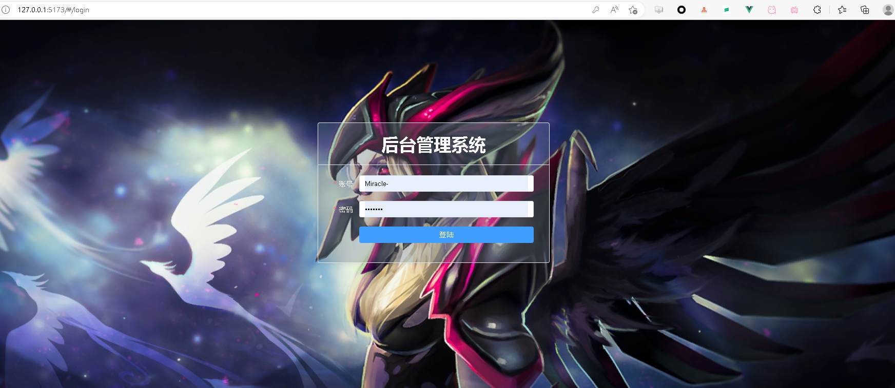
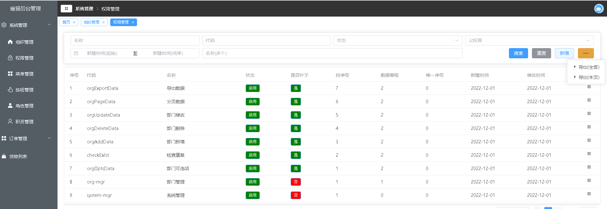
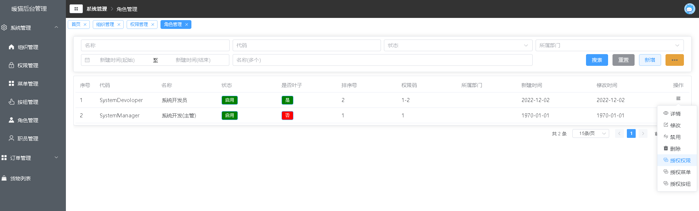
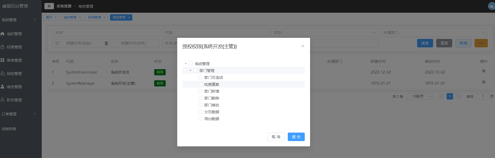

# background-management-system


This template should help get you started developing with Vue 3 in Vite.

## 简单介绍

这是一个使用 vite+vue3+elementplus+pinia+ts的后台管理系统
包括 `部门组织` `权限控制` `菜单权限配置` `按钮权限配置` `角色管理` `用户管理` 共六个模块
相对来说完成度还是比较高的


### 效果图预览










### 线上预览地址


## Project Setup

```sh
npm install
```

### Compile and Hot-Reload for Development

```sh
npm run dev
```

### Type-Check, Compile and Minify for Production

```sh
npm run build
```

### Lint with [ESLint](https://eslint.org/)

```sh
npm run lint
```
